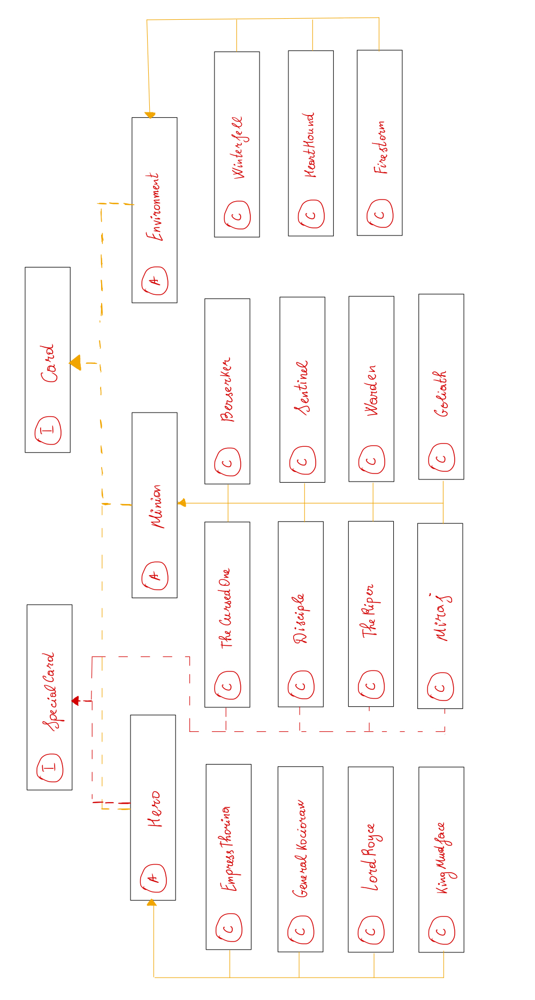

# **Gwent Stone**
True based story about two famous games **Heartstone** and **Gwent**.

## **Table of contents**

1. [Getting Started](#start-desc)
   1. [Description](#start-desc-desc)
2. [Main Functionality](#main-desc)
   1. [Project Structure](#main-proj-desc)
   2. [File hierarchy](main-file-desc)
3. [Main Game](#game-desc)
4. [Cards Package](#cards-desc)
   1. [Description](#cards-desc-desc)
   2. [ULM Schema](#cards-ulm-desc)
   3. [Explaining the ULM](#cards-expl-desc)
5. [Players Package](#players-desc)
6. [Battlefield Package](#battle-desc)
7. [Commands Package](#commands-desc)
8. [Actions Package](#actions-desc)

## **Getting Started**

### Description

Basically this task is to test our knowledge about basic *OOP* concepts.
Even if I have some practice working with Java and *OOP* concepts, I found this
homework a little tricky. Overall I had a very great time working on the
project and I hope next tasks will be funnier than this one.

I hope you also will have a great time checking my assignment and reading
this **README** file. I would like to know what you liked most or less about this
readme and my project in general.

Now let's stop talking and get to good work.

## **Main Functionality**

### **Project Structure**

The project is divided in 6 packages (not included the skeleton packages).
We will discuss every package and I will explain how every class communicates
with another class.

For a better understanding I will present you some **UML** schemas in every
package section and will discuss a lot more in the following sections.

### **File hierarchy**

My implementation of the project can be found in the following packages:

* *actions* - a special class to maintain the action processing.
* *battlefield* - a class for the game table.
* *cards* - a whole package containing all the card logic.
* *commands* - special class, working as **log** functions/classes.
* *game* - a singleton class maintaining the whole game logic.
* *players* - a package designed for players functionalities.

## **Main Game**

## **Cards Package**

### **Description**

The cards package are one of the most important package, because it contains the logic
of a card, the maintenance of a card, how a card works, what should it do in some
cases. This package has a very low communication with the other classes (in other
words it is encapsulated in its package, however other classes use them to instance
objects of **Minions** or other cards).

Even though the class is almost hidden from the entire word we need some functionalities
or some information about the game, in this case we will use the **Singleton** class
game to get some data, but overall no extern binding is needed.

### **ULM Schema**

### **Explaining the ULM**

To keep the functionalities broken in some chunks of code, I created interfaces and
abstract classes. The main two interfaces are *Card* (the most generic interface all the
game is based on this interface) and *SpecialCard* which is an interface to signal
to the other chunks of code that the card has a special attack that can be used to attack
your opponent cards.

From these interfaces we can implement **3** abstract classes. The first class
is the **Minion** abstract class which is basically am effective card that can be placed on
the table and can perform simple actions (like attacking other minions), however
some minions can have special attack, so they also implement the **SpecialCard** interface

The Minion class implements the most of the **card** functionality and adds to it some abstract
functions left for the children classes to implement the methods. The **Minion** is very
important for the hierarchy, because it maintains the whole card structure, and we avoid code
duplication.

The next class is the **Environment** class, the main reason of environment class existence is that
an environment class cannot be placed on a table and do not follow the rules of a **Minion** card.
Even though the class does not come with some abstract methods it should be abstract to throw
the implementation to its children, and also we should not be able to create an instance
of an environment class, because it does not know what to do on a battlefield (in other
words, it can process an attack to another opponent).

The last abstract class is **Hero** class, which maintain the Hero cards. Now
why haven't I extended the class **Minion** for the Hero cards? The answer is because
the Hero is not a minion, and it cannot be placed on the table, also the functionalities
of the Hero card are different from the Minion card, the first difference is that
a Hero card cannot attack another card (it can use a special ability) and a hero
card cannot be frozen.

>**NOTE:** Overall the cards hierarchy is thought to keep the cards functionalities
> very easy and to encapsulate the same properties in one place and to use them
> anywhere from the extended classes. 

## **Players Package**

## **Battlefield Package**

## **Commands Package**

## **Actions Package**