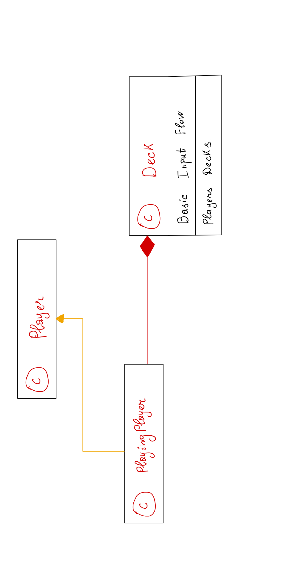
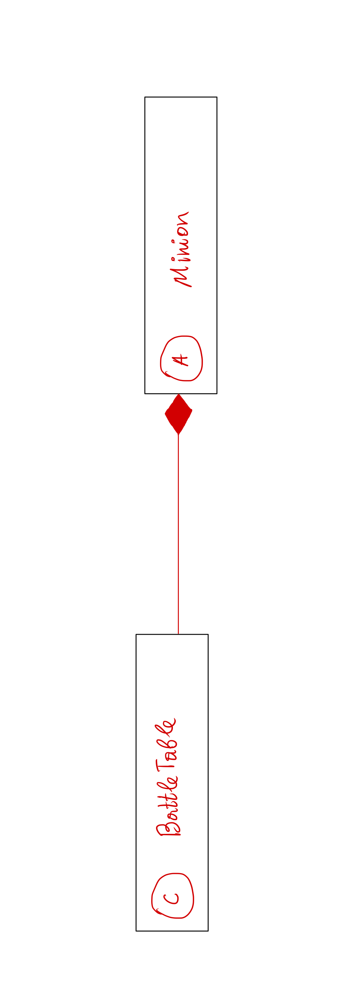
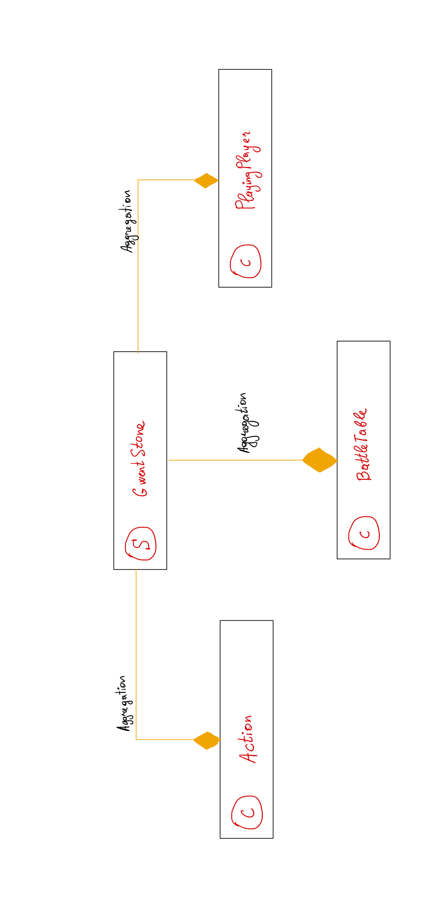

# **Gwent Stone**
True based story about two famous games **Heartstone** and **Gwent**.

## **Table of contents**

1. [Getting Started](#start-desc)
   1. [Description](#start-desc-desc)
2. [Main Functionality](#main-desc)
   1. [Project Structure](#main-proj-desc)
   2. [File hierarchy](main-file-desc)
3. [Cards Package](#cards-desc)
   1. [Description](#cards-desc-desc)
   2. [ULM Schema](#cards-ulm-desc)
   3. [Explaining the ULM](#cards-expl-desc)
4. [Players Package](#players-desc)
   1. [Description](#players-desc-desc)
   2. [ULM Schema](#players-ulm-desc)
   3. [Explaining the ULM](#players-expl-desc)
5. [Battlefield Package](#battle-desc)
   1. [Description](#battle-desc-desc)
   2. [ULM Schema](#battle-ulm-desc)
   3. [Explaining the ULM](#battle-expl-desc)
6. [Actions Package](#actions-desc)
   1. [Description](#actions-desc-desc)
   2. [Need of class](#actions-expl-desc)
7. [Commands Package](#commands-desc)
   1. [Description](#commands-desc-desc)
   2. [Why Static?](#commands-expl-desc)
8. [Main Game](#game-desc)
   1. [Description](#game-desc-desc)
   2. [ULM Schema](#game-ulm-desc)
   3. [Usages and binding](#game-expl-desc)
9. [Bonus](#bonus-desc)

## **Getting Started**

### **Description**

Basically this task is to test our knowledge about basic *OOP* concepts.
Even if I have some practice working with Java and *OOP* concepts, I found this
homework a little tricky. Overall I had a very great time working on the
project and I hope next tasks will be funnier than this one.

I hope you also will have a great time checking my assignment and reading
this **README** file. I would like to know what you liked most or less about this
readme and my project in general.

Now let's stop talking and get to good work.

## **Main Functionality**

### **Project Structure**

The project is divided in 6 packages (not included the skeleton packages).
We will discuss every package and I will explain how every class communicates
with another class.

For a better understanding I will present you some **UML** schemas in every
package section and will discuss a lot more in the following sections.

### **File hierarchy**

My implementation of the project can be found in the following packages:

* *actions* - a special class to maintain the action processing.
* *battlefield* - a class for the game table.
* *cards* - a whole package containing all the card logic.
* *commands* - special class, working as **log** functions/classes.
* *game* - a singleton class maintaining the whole game logic.
* *players* - a package designed for players functionalities.

## **Cards Package**

### **Description**

The cards package are one of the most important package, because it contains the logic
of a card, the maintenance of a card, how a card works, what should it do in some
cases. This package has a very low communication with the other classes (in other
words it is encapsulated in its package, however other classes use them to instance
objects of **Minions** or other cards).

Even though the class is almost hidden from the entire word we need some functionalities
or some information about the game, in this case we will use the **Singleton** class
game to get some data, but overall no extern binding is needed.

### **ULM Schema**

### **Explaining the ULM**

To keep the functionalities broken in some chunks of code, I created interfaces and
abstract classes. The main two interfaces are *Card* (the most generic interface all the
game is based on this interface) and *SpecialCard* which is an interface to signal
to the other chunks of code that the card has a special attack that can be used to attack
your opponent cards.

From these interfaces we can implement **3** abstract classes. The first class
is the **Minion** abstract class which is basically am effective card that can be placed on
the table and can perform simple actions (like attacking other minions), however
some minions can have special attack, so they also implement the **SpecialCard** interface

The Minion class implements the most of the **card** functionality and adds to it some abstract
functions left for the children classes to implement the methods. The **Minion** is very
important for the hierarchy, because it maintains the whole card structure, and we avoid code
duplication.

The next class is the **Environment** class, the main reason of environment class existence is that
an environment class cannot be placed on a table and do not follow the rules of a **Minion** card.
Even though the class does not come with some abstract methods it should be abstract to throw
the implementation to its children, and also we should not be able to create an instance
of an environment class, because it does not know what to do on a battlefield (in other
words, it can process an attack to another opponent).

The last abstract class is **Hero** class, which maintain the Hero cards. Now
why haven't I extended the class **Minion** for the Hero cards? The answer is because
the Hero is not a minion, and it cannot be placed on the table, also the functionalities
of the Hero card are different from the Minion card, the first difference is that
a Hero card cannot attack another card (it can use a special ability) and a hero
card cannot be frozen.

>**NOTE:** Overall the cards hierarchy is thought to keep the cards functionalities
> very easy and to encapsulate the same properties in one place and to use them
> anywhere from the extended classes. 

## **Players Package**

### **Description**

Because no game exists without players, I created some functionalities for basic
players. This package as **cards** package does not communicate very much with the
extern classes (in order words it does not call or create instances of objects from
other packages).

>**NOTE:** Even though I told you that the package tries not to work with extern packages
> it would be a lie. In order to process input data we have to communicate with a third-party
> class (the classes from the **fileio** package), however the communication is very low
> and is only needed at constructors when we initialize the objects.

### **ULM Schema**

### **Explaining the ULM**

For this design I chose not to work with abstract classes or interfaces, because
it would be unuseful. In every game a player can exist by its own (even though
for this game we do not call explicit the Player constructor, we use it for the **PlayingPlayer**
class which will be the most important class from entire game).

The **Player** class is a collection of data, about the player that will want in some time
to play a game. The class stores all the decks that are available for the user and the win games.
I tried to keep it as simple I could, because we will not be using this class
very much, however and is very important for the flow of thoughts and to strengthen the
logic behind the game.

>**NOTE:** In future if we would like to add some more functionalities than
> it would be easier to change something in the Player class instead of working on
> the PlayingPlayers class or even the Deck class. The Player class is more to break
> the logic code in some steps to achive a bigger goal.

The next class, **Deck** as it name suggests it's a collection of some cards,
which makes the entire deck. The Deck Object can be created with **3** methods:
* *From input data*
* *From another deck data*
* *Create an empty deck* - this method will be useful when we will create the
* player hand, and we would like to have no card until the game is started.

Behind the scenes the **Deck** class is just a simple *wrapper* class for the *List and ArrayList*
structures. We want to keep the functionality of adding removing or changing some cards
in the Deck class and not to expose them to the world.

The last class is **PlayingPlayer** which has two relations with the classes discussed above:
* *With Deck* - Aggregation
* *With Player* - Inheritance

We want that every **playing player** will have a deck to takes cards from
and a hand to put his cards. For this functionality to work we need to have some decks.
On the other hand a player cannot play if it is not a player, for this we need to
inherit the **Player** class and to give **basic** functionalities to a player.

>**NOTE:** As I mentioned above the whole Player structure is found in the **PlayingPlayer**
> , because the playing player can have an allocated hero *which a simple player cannot have)
> it also can choose a deck to play the game session it can be his turn or not and
> finally it can gain mana for the game or can lose it. This is the strongest reson
> why I have created the **PlayingPlayer** class.

## **Battlefield Package**

### **Description**

As for players there cannot be a valid game if there is not a right and
**dangerous** battlefield filled with a lot of angry and harmfully **Minions**.
As usual, the **BattleTable** Class that exists int this package does try
not to communicate with the outer world, however it has a **strong** connection
with the **Minion** class that we will discuss in the next sections. For now keep
enjoying the beauty of a good game.

### **ULM Schema**

### **Explaining the ULM**

The **BattleTable** Class is as easy as it sounds. The class is a maintainer
of a matrix full of **minions**, and all the actions are related to the main
matrix **table** field (the core of the class itself). It is very important to understand
that the class cannot exist without *minions*, because it will be just a simple field and
not a **battlefield**.

Keep for now in mind that the **BattleTable** Object (when it will be instanced) is the main place
where all the actions happen, for this reason I tried to encapsulate the functionalities as much as I could,
for this reason the only instance where the **BattleTable** can be found is in the **GwentStone** class,
however about this special class we will discuss in the next sections.

>**NOTE:** A very important nuance is that the battle table has some functions to check the table
> integrity and to clear the table after each game session played (match). More about this functionality
> will be discused on the *Main game* section 

## **Actions Package**

### **Description**

Because our game works on fetching commands and printing the output,
I came with the idea that will be nice and a very good practice
to create a separate class that will handle the actions and store
all the information about the actions.

In general as many of my classes the **Action** class is a wrapper
for a **List** of actions (an action is an instance of *ActionsInput*),
the game does not care about the actions and commands and parse the
information to the **Action** class that knows how to handle the
situation.

>**NOTE:** I am aware that this class is a former class and could be easily deleted
> however as I tried to tell during our discuss that is best practice to modularize
> all the functions and not to fill one class with a bunch of functionality when
> it can be break down and be maintained a lot easier and a lot intuitively.

### **Need of class**

As I mentioned above the **Action** class is practically a handler for our commands.
The game class does not know what to do when a command enters so the information
is parsed to this class and any action needed is taken.

The Action class knows for every time of action what to do and how to maintain the
code in order not to break the game. Imagine that the whole command processing
would be in the game class or encapsulated in another card (Player for example),
it would break view of the whole **OOP** concepts.

The **Action** class uses mainly the **log** functions from the **commands**
package. I needed first to explain this class in order for you to understand why I
implemented the **commands** classes like that.

>**NOTE:** A better explanation of the commands classes will be found in the **Commands Package**
> section and the reason for implementing them as a log classes.

## **Commands Package**

### **Description**

Now that we have discussed the **Action** class and why we need it,
I can explain to you what are the **Commands** classes (collections.)

Every action has to perform or process a command, and the commands are totally
different between them, so if we would add the whole functionality to the **Action**
class it would be a total mess. Instead of using the **Actions** class that works like
a handler, I came to the idea to create different collections that know how to solve
the commands.

Imagine the above words like this: 
When you are doing some applications in **JavaFX** and you want
to catch an event and to run a handler you can do this very easy by
calling the specific function for the event catching and then
create an anonymous class or a lambda function that solves your problem.

The same idea is behind these **Commands** collections, think of them
as the lambda functions that know how to handle a specific problem.
The **Action** class works as the event catching and then processes the
code from the lambda function (meaning our **Command** function).

>**NOTE:** The **Commands** classes have static methods and should not be
> instanced by any meaning. The static methods reason will be presented
> in the next subsection.

### **Why Static?**

As you have read above, **Commands** classes are collections
of static methods, in general they have just one function that solves
just one command, but the command class for the **debugging** actions
have more than one static function.

It would be a chaos to instantiate a new **Command** class just to process
a single command (as the lambda functions you right it now and call it now and
then forget about it). The collection of static methods is the most suitable
way to manage the actions.

Even though you can tell me that it break the concepts of **OOP**, it will be
a lie, because the functions are structured in such way that they could be easily
managed and if you want to refactor something, it would be a lot easier.

For example, I refactored the commands code for **3** time, and it was very
easy, because I used this implementation.

>**NOTE:** You can argue with me and tell me that it would be better to place them
> in **Action** class, however it would be made the **Action** class a mess and not
> a class, as I have said breaking and modulation of the code is the best thing
> we can do to keep our code easy to program and to read after that.

## **Main Game**

### **Description**

Now that we have discussed all the main *classes* that build the game,
let's talk about the one class that combine them all, **GwentStone** class.

This class represents a **Singleton** class, using the Bill Pugh Eager Singleton
implementation, which is the best in case of using **threading**, even so we do not
work on a multiple thread level for me is the best implementation ever of a Singleton class.

I have chosen to create the game class as a Singleton for the following reasons:
* *Very easy to parse information from one place to another*
* *Easy communication between every class*
* *Easy to implement and easy to maintain*
* *It should be impossible to have more games in one game*
* *A very good reason to practice more on singleton patterns*

>**NOTE:** Because we have broken the code into many classes, the GwentStone class
> has simple and basic instructions to follow a game loop (preprocess, start, update and exit
> methods that are private and run internally in the game).

### **ULM Schema**

### **Usages and Binding**

The **GwentStone** Singleton is the most used instance in the whole project,
the most usages of the class take place in the commands collections, because
they need information about the game progress to make and assumption and to
print an output.

Now recalling our idea if we had not implemented the **Commands** collections
we would have to insert all the code into the *game* class, now imagine what
mess would it be.

All the accesses and information about players, minions, battlefield,
player hand, player deck, statistics and heroes is fetched from the Singleton
class so this pattern gives us the possibility to make our code easy
to understand and to implement.

## **Bonus**

For this section I want to present some usages that I implemented
in my code. (in other words good practices).

* *Very good file structure* - every class is modularized in a different
package along with other classes that maintain the same functionality.
* *Code very easy to follow and good structure* - I tried to give name functions to understand very easy
what and how every function performs.
* *JavaDoc* - every class, method, field has its own *JavaDoc*, so you could understand
easier what every piece of code is doing.
* *Using streams* - I used a lot of methods as filter, anyMatch, forEach
and tried to keep the things very easy with streams.
* *Say not to for loops* - If you look at my code you observe that there
are very few for loops, instead of them I used streams and **List.forEach**.
* *Using lambda functions* - It is clear that usage of the streams imply
usage of lambda functions, however you can perform streams using the
anonymous classes, however I used just lambda functions.

>**NOTE:** Overall I had a lot of fun doing this game and hope the following assignments
> will be as funny as this one. This is all I had to say to you, if you have made it
> this far that it means you are a [find here](https://www.youtube.com/watch?v=1LZZYemqLyU).
> Feel free to contact my via my email address **determinant289@gmail.com** if you
> have any other questions about my implementation. Have a good time!!!